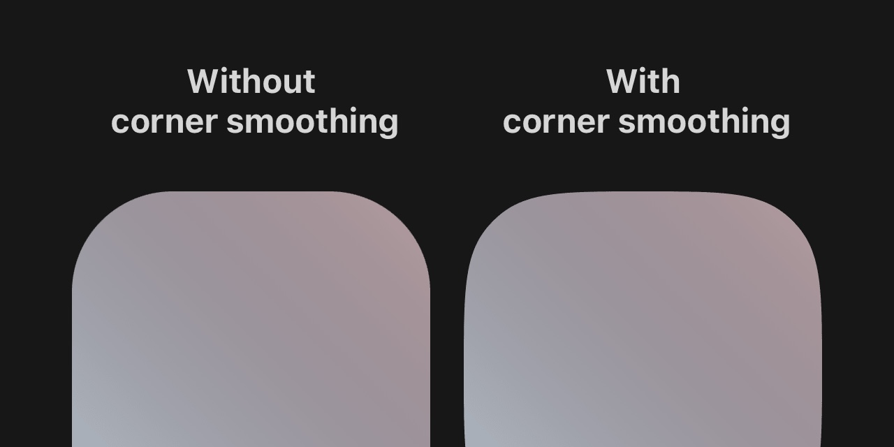

<div align="center">

# squircle

**SwiftUI-accurate squircles in every browser — as a Tailwind plugin.**

[**▸ Live playground**](https://spatio-labs.github.io/squircle/) — edit a class, watch the `clip-path`.

[](https://www.npmjs.com/package/@spatio-labs/squircle)
[](https://bundlephobia.com/package/@spatio-labs/squircle)
[](./tailwind.d.ts)
[](./LICENSE)



</div>

The squircle is the corner that makes Apple's UI feel _settled_ — a continuous
curve that flows into the edge instead of snapping into an arc. `squircle`
brings it to the web as Tailwind utilities, rendering the **real SwiftUI corner**
(not the rougher CSS `superellipse(2)`) in **every evergreen browser**.

```html
<div class="rounded-2xl squircle">Hello, continuous corner.</div>
```

## Install

```bash
npm i @spatio-labs/squircle
```

`tailwindcss` is an optional peer dependency.

## Setup

Register the plugin, then call the runtime once on the client.

```js
// tailwind.config.js
const squircle = require("@spatio-labs/squircle");

module.exports = {
  plugins: [squircle],
};
```

```js
// app entry
import { initCorners } from "@spatio-labs/squircle/corners";

initCorners();
```

That's it. `initCorners()` scans the page, draws each corner with a `clip-path`,
and keeps it sharp through resizes and DOM changes. `clip-path` + `ResizeObserver`
ship in every modern browser, so the result is identical in Chrome, Firefox, and
Safari.

## Utilities

```html
<div class="rounded-2xl squircle">…</div>               <!-- SwiftUI continuous corner -->
<div class="rounded-2xl corner-smooth-[0.85]">…</div>   <!-- custom smoothing, 0–1 -->
<div class="rounded-2xl corner-superellipse-3">…</div>  <!-- raw CSS superellipse exponent -->
<div class="rounded-xl corner-scoop">…</div>            <!-- concave -->
```

| Utility | Shape |
| --- | --- |
| `squircle` · `corner-squircle` | SwiftUI continuous corner (iOS smoothing) |
| `corner-smooth-{0,45,ios,60,full,100}` · `corner-smooth-[0.85]` | Continuous corner, custom smoothing `0`–`1` |
| `corner-round` `corner-bevel` `corner-scoop` `corner-notch` `corner-square` | The CSS [`corner-shape`](https://developer.mozilla.org/en-US/docs/Web/CSS/Reference/Values/corner-shape-value) keywords |
| `corner-superellipse-{0..4}` · `corner-superellipse-[3.5]` · `corner-superellipse-[-1]` | Raw superellipse exponent |

The radius comes from your normal Tailwind radius utilities (`rounded-md`,
`rounded-[20px]`); the `corner-*` class only changes the corner _shape_.

### Make everything a squircle

```js
module.exports = {
  plugins: [squircle({ global: true })],
};
```

```html
<div class="rounded-md">Every rounded element is now a squircle.</div>
```

## Without Tailwind

The runtime stands alone, driven by a `data-corner-shape` attribute that accepts
`squircle` / `continuous` or any `<corner-shape-value>`:

```html
<div style="border-radius: 24px" data-corner-shape="squircle"></div>
<div style="border-radius: 24px" data-corner-shape="superellipse(3)"></div>
```

```js
import { initCorners } from "@spatio-labs/squircle/corners";
initCorners();
```

A plain-CSS file is included for the native `corner-shape` values (Chromium 139+,
no runtime): `@import "@spatio-labs/squircle/squircle.css"`.

## Why not the native CSS property?

Native [`corner-shape`](https://developer.mozilla.org/en-US/docs/Web/CSS/corner-shape)
is Chromium-only today, and its `squircle` keyword is `superellipse(2)` — close,
but tighter than Apple's curve. SwiftUI's `.continuous` corner spreads the bend
onto the straight edges (the [Figma smoothing model](https://www.figma.com/blog/desperately-seeking-squircles/),
iOS ≈ 0.6). `squircle` draws that exact curve, so a single class gives you
the genuine iOS look everywhere.

## API

Full plugin options and runtime exports (`initCorners`, `squirclePath`,
`superellipsePath`, `parseShape`, `supportsNative`) are in the
[**API reference**](./api.md).

## Credits

- [Desperately seeking squircles](https://www.figma.com/blog/desperately-seeking-squircles/) — Figma
- The CSS [`corner-shape`](https://developer.mozilla.org/en-US/docs/Web/CSS/Reference/Values/corner-shape-value) specification

## License

[ISC](./LICENSE) © Matthew Park
